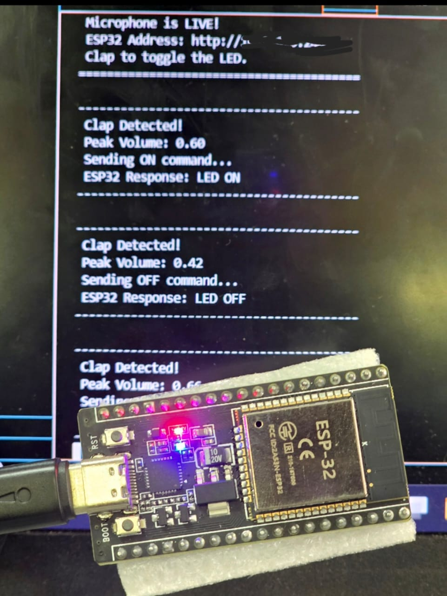

# IoT-ClapSwitch

A Python and ESP32-based IoT clap detection system that wirelessly controls an ESP32 over Wi-Fi using HTTP communication. The project demonstrates real-time audio processing, embedded systems programming, networking and Internet of Things (IoT) concepts.

---

## Features

- Real-time microphone monitoring
- Clap detection using audio peak analysis
- Wireless communication over Wi-Fi
- HTTP communication between Python and ESP32
- Real-time LED control
- Low-latency wireless operation

---

## Example Output

The image below shows the Python application detecting a clap while wirelessly controlling the ESP32 built-in LED.



---

## How It Works

1. Python continuously listens to the computer microphone.
2. A clap is detected using audio peak analysis.
3. Python sends an HTTP request over Wi-Fi.
4. The ESP32 receives the request.
5. The ESP32 toggles its built-in LED.
6. The ESP32 sends a response back to Python.

---

## Hardware Required

- ESP32 Development Board
- USB Cable
- Computer
- Wi-Fi Network

---

## Software Requirements

- Python 3.10 or later
- Arduino IDE
- ESP32 Arduino Board Package

---

## Installation

Clone the repository

```bash
git clone https://github.com/FrankRubandamayonzaMagezi/IoT-ClapSwitch.git
```

Navigate into the project

```bash
cd IoT-ClapSwitch
```

(Optional) Create a virtual environment

Windows

```bash
python -m venv venv
venv\Scripts\activate
```

Linux/macOS

```bash
python3 -m venv venv
source venv/bin/activate
```

Install the dependencies

```bash
pip install -r requirements.txt
```

---

## ESP32 Setup

1. Open

```
arduino/ESP32_ClapSwitch/ESP32_ClapSwitch.ino
```

2. Select

```
ESP32 Dev Module
```

3. Enter your Wi-Fi SSID and password.

4. Upload the sketch.

5. Open the Serial Monitor.

6. Note the IP Address assigned to the ESP32.

7. Update the IP address in

```
main.py
```

```python
ESP32_IP = "http://YOUR_ESP32_IP"
```

---

## Running the Project

Run

```bash
python main.py
```

Clap once to turn the LED ON.

Clap again to turn the LED OFF.

---

## Project Structure

```
IoT-ClapSwitch/
│
├── arduino/
│   └── ESP32_ClapSwitch/
│       └── ESP32_ClapSwitch.ino
│
├── images/
│   └── iot_clapswitch_demo.jpeg
│
├── main.py
├── requirements.txt
├── README.md
├── LICENSE
└── .gitignore
```

---

## Future Improvements

- Adjustable clap sensitivity
- Noise filtering
- Multiple clap detection
- MQTT communication
- Cloud connectivity
- Mobile application
- Web dashboard
- Relay control
- Smart home integration
- TinyML-based clap recognition

---

## License

This project is licensed under the MIT License. See the LICENSE file for details.

---

## Author

Frank Rubandamayonza Magezi

Embedded Systems | IoT | Artificial Intelligence | Automation