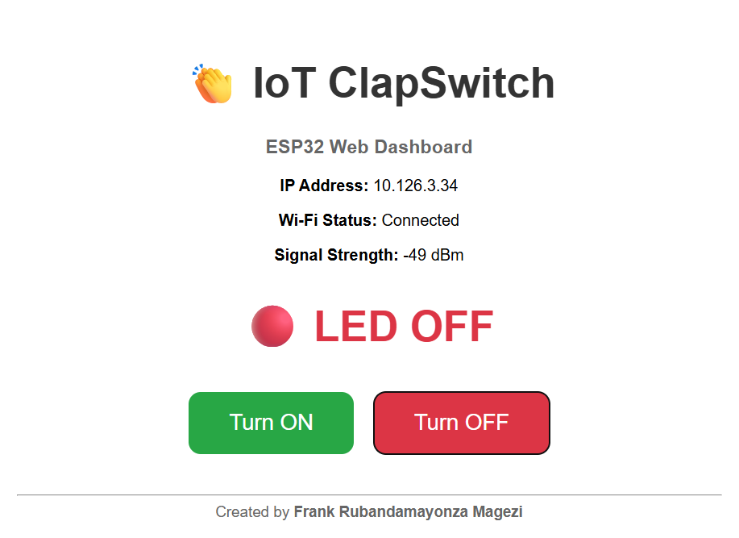

# IoT ClapSwitch

An IoT-enabled clap detection system that listens through the computer microphone and controls an ESP32 wirelessly over Wi-Fi.

When a clap is detected, the Python application sends an HTTP request to the ESP32, which toggles its built-in LED in real time. The ESP32 also hosts a responsive web dashboard that allows users to monitor the LED status and control it remotely from any device connected to the same network.

---

## Features

- Real-time microphone monitoring
- Clap detection using audio peak analysis
- Wireless communication over Wi-Fi
- HTTP communication between Python and ESP32
- Responsive web dashboard
- Live LED status updates
- Manual LED ON/OFF controls
- Real-time dashboard updates without page refresh
- ESP32 built-in LED control

---
## Screenshots

### Python Application and LED Output

The image below shows the Python application detecting a clap while wirelessly controlling the ESP32 built-in LED.


### ESP32 Web Dashboard

The ESP32 hosts a responsive web dashboard that displays the current LED status and allows manual control over Wi-Fi.




---

## How It Works

1. The Python application continuously monitors the computer microphone.
2. When a clap exceeds the configured threshold, it is detected.
3. The application toggles a virtual switch state.
4. An HTTP request is sent to the ESP32 over the local Wi-Fi network.
5. The ESP32 receives the request and toggles its built-in LED.
6. The web dashboard automatically updates the LED status in real time.

---

## Hardware Required

- ESP32 Development Board
- USB Cable
- Computer with Python installed
- Wi-Fi Network

---

## Software Requirements

- Python 3.10 +
- Arduino IDE
- ESP32 Board Package

## Technologies Used

- Python
- NumPy
- SoundDevice
- Requests
- Wi-Fi
- HTTP Protocol
- HTML
- CSS
- JavaScript

---

## Installation

Clone the repository

```bash
git clone https://github.com/FrankRubandamayonzaMagezi/IoT-ClapSwitch.git
```

Navigate into the project

```bash
cd IoT-ClapSwitch
```

(Optional) Create a virtual environment

Windows

```bash
python -m venv venv
venv\Scripts\activate
```

Linux/macOS

```bash
python3 -m venv venv
source venv/bin/activate
```

Install the dependencies

```bash
pip install -r requirements.txt
```

---

## ESP32 Setup

1. Open

```
arduino/ESP32_ClapSwitch/ESP32_ClapSwitch.ino
```

2. Select

```
ESP32 Dev Module
```

3. Enter your Wi-Fi SSID and password.

4. Upload the sketch.

5. Open the Serial Monitor.

6. Note the IP Address assigned to the ESP32.

7. Update the IP address in

```
main.py
```

```python
ESP32_IP = "http://YOUR_ESP32_IP"
```

---

## Running the Project

Run

```bash
python main.py
```

Clap once to turn the LED ON.

Clap again to turn the LED OFF.

---

## Project Structure

```
IoT-ClapSwitch/
│── arduino/
│   └── ESP32_ClapSwitch/
│       └── ESP32_ClapSwitch.ino
│── images/
│   ├── iot_clapswitch_demo.jpeg
│   └── iot_webdashboard.png
│── main.py
│── requirements.txt
│── README.md
│── LICENSE
└── .gitignore
```

---

## Future Improvements

- MQTT communication
- Cloud dashboard
- Remote internet access
- Mobile application
- Multiple ESP32 devices
- TinyML-based clap recognition
- Voice control
- Home automation integration
- OTA firmware updates
- User authentication

---

## License

This project is licensed under the MIT License. See the LICENSE file for details.

---

## Author

Frank Rubandamayonza Magezi

Embedded Systems | IoT | Artificial Intelligence | Automation